# Espresso Shot Annotation Guidelines

**Project:** Espresso Extraction over Local Michigan-Roasted Coffee Beans
**Contact:** Elliot Pak, [etpak@umich.edu](mailto:etpak@umich.edu) / Discord: @elliotpak **Estimated time:** ~30 seconds per shot (both images)

---

## 1. Your Job

Each shot in this dataset comes with two photos, and you will give each photo its own label:

1. **Puck photo** → rate **Channeling Severity** (None / Low / Medium / High)
2. **Crema photo** → rate **Apparent Extraction** (Under / Balanced / Over)

**Judge each photo only on what you see in that photo.** Do not let the puck influence your crema rating or vice versa. Do not guess based on other shots you have seen. No coffee knowledge is needed; everything you need is in this document.

For each label you will also set a **confidence slider** (1 = guessing, 5 = certain). Use it honestly, because low-confidence labels are useful data, not mistakes.

---

## 2. Quick Background

- **Espresso** is made by forcing hot water through a tightly packed disc of ground coffee.
- **Puck:** the disc of wet, used coffee grounds left in the metal basket after the shot. The photos are taken looking down into the basket.
- **Channeling:** when water finds a weak spot and rushes through a narrow path instead of flowing evenly through the whole puck. It leaves visible marks on the puck surface.
- **Crema:** the layer of tan/brown foam on top of an espresso shot. The photos are taken looking straight down into the cup.

---

# PART A: Puck Photo, Channeling Severity

## A1. What to Look For

Before choosing a severity, tick every feature you see in the checklist (in the interface):

| Feature            | What it looks like                                                                         |
| ------------------ | ------------------------------------------------------------------------------------------ |
| **Pinholes**       | Small, dark, round holes or pits in the surface, roughly pencil-tip to pea sized           |
| **Cracks**         | Thin lines or fissures splitting the surface                                               |
| **Edge gap**       | A dark gap or trench where the puck has pulled away from the metal wall of the basket      |
| **Wet pooling**    | Shiny standing water or a noticeably wetter/darker patch, as opposed to an even dull sheen |
| **Uneven color**   | Distinct lighter and darker zones, instead of one consistent shade                         |
| **Craters/divots** | Larger depressions or collapsed areas deeper than the surrounding surface                  |

## A2. What to IGNORE (normal, not channeling)

These appear on almost every puck and are **not** signs of channeling:

- **Shower screen imprint:** a faint circular pattern, grid, or ring of dots pressed into the surface.
- **Center screw mark:** a single small indent or bump exactly in the center of the puck.
- **Even light sheen:** the whole surface looks uniformly damp.
- **Smooth, even texture** with tiny uniform dimples across the whole surface.
- **Grounds stuck to the rim** of the basket above the puck surface.
- **Lighting glare:** bright white reflections on the metal basket or a wet surface. Check whether the "spot" moves consistently with the light source rather than being a feature of the coffee.

## A3. Labels

### None

The surface is **even and intact**. Color and texture are consistent across the puck. Only normal features from A2 are present.

- No pinholes, cracks, edge gap, or pooling.

### Low

**One minor, isolated flaw** on an otherwise even puck.

- 1–2 small pinholes, **or**
- one small wet spot (smaller than a fingertip), **or**
- a very short, shallow edge gap (a small sliver along the wall).
- The rest of the puck looks like "None."

### Medium

**Clear flaws in more than one spot, or one obvious flaw.**

- 3 or more pinholes, **or**
- one visible crack, **or**
- an edge gap along a noticeable portion of the wall (up to about a quarter of the way around), **or**
- a wet pool or uneven-color zone covering a clearly visible area (larger than a fingertip, less than about a quarter of the surface).
- Much of the puck still looks even.

### High

**Widespread or severe damage.** The puck clearly did not extract evenly.

- Multiple cracks, or a crack running across a large part of the puck, **or**
- deep holes or craters, **or**
- an edge gap running more than about a quarter of the way around, **or**
- pooling or uneven color covering roughly a quarter of the surface or more, **or**
- several different medium-level flaws together.

## A4. Decision Rules

1. **Judge by the worst area, then consider the whole.** Find the most severe flaw first and match it to a level. Then bump **up one level** if there are several separate flaws of that same level.
2. **Between two levels and truly unsure?** Pick the **lower** level and lower your confidence slider.
3. **Photo too blurry or dark to judge?** Pick your best guess, set confidence to 1, and tick the **"Image quality issue"** box.
4. **Don't count the same thing twice:** a crack that ends in a hole is one flaw, not two.
5. **Size references:** the basket is about 58 mm (about 2.3 in) across. A fingertip-sized spot is roughly 1/4 of the way from the center to the wall.

## A5. Examples

Click a photo to open it full size.

### None

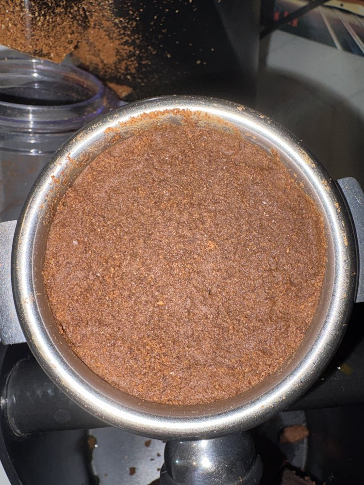 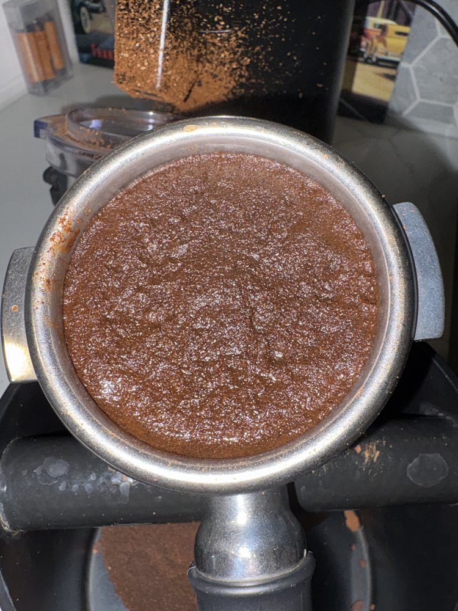

- **Left:** a dull, even surface with consistent color and texture all the way to the wall.
- **Right:** an even surface with no holes, cracks, gaps, or wet patches.
- *Why not Low:* there is no isolated flaw anywhere.

### Low

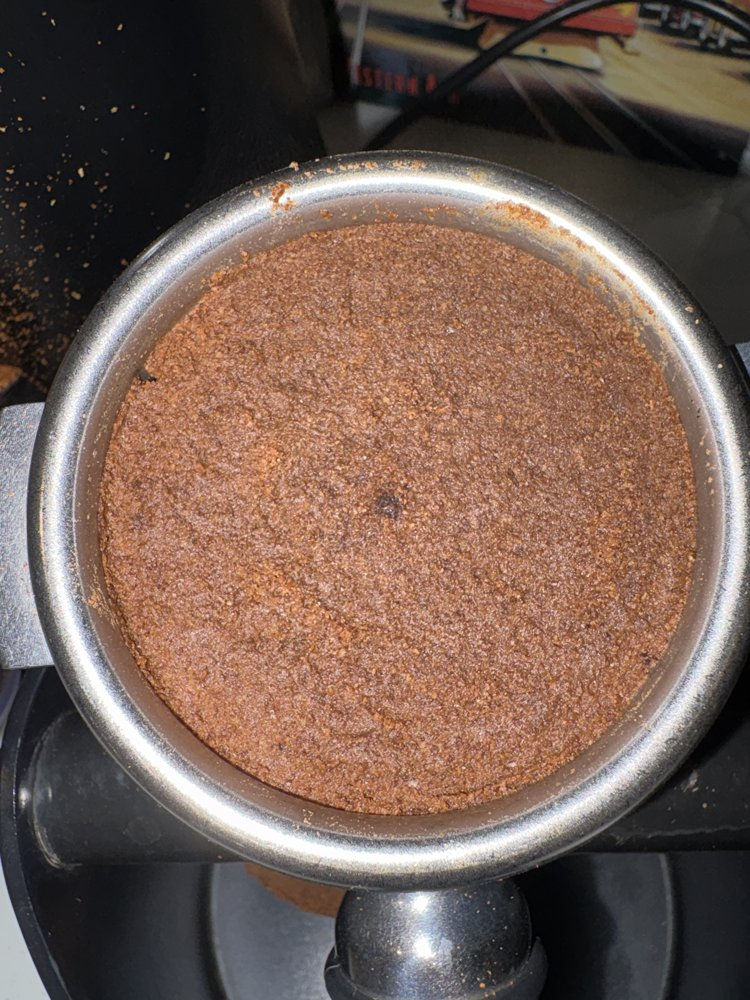 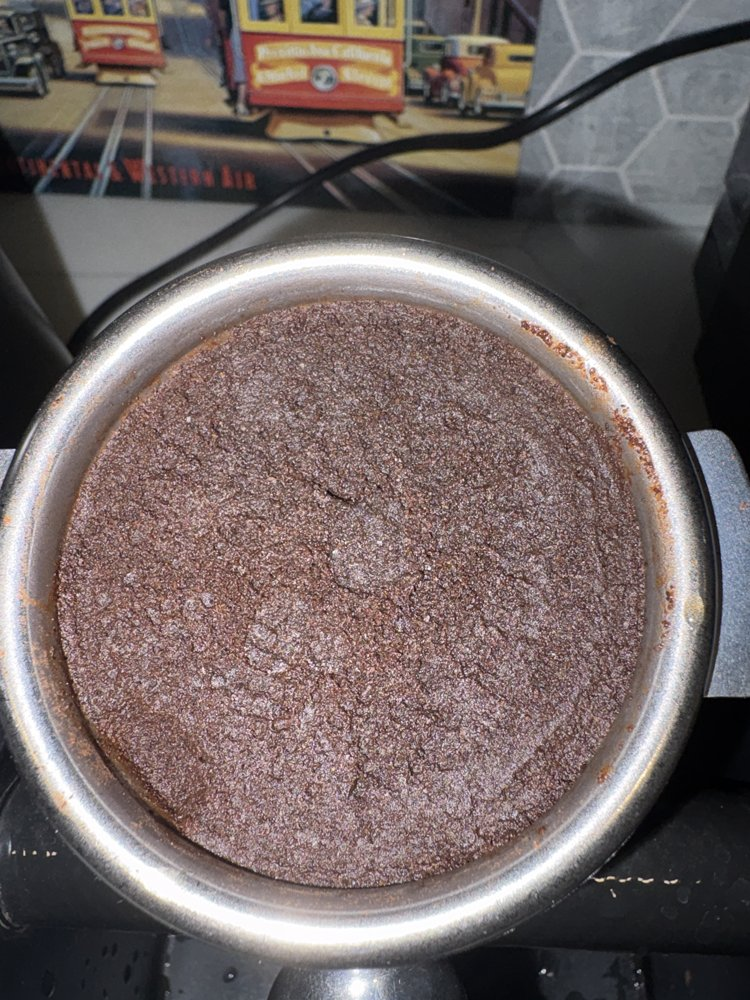

- **Left:** a single dark pinhole just above the center. Everything else is even.
- **Right:** one small, shallow mark near the center. The rest of the puck is even.
- *Why not Medium:* each puck has only one small, isolated flaw, with no pooling or gap.

### Medium

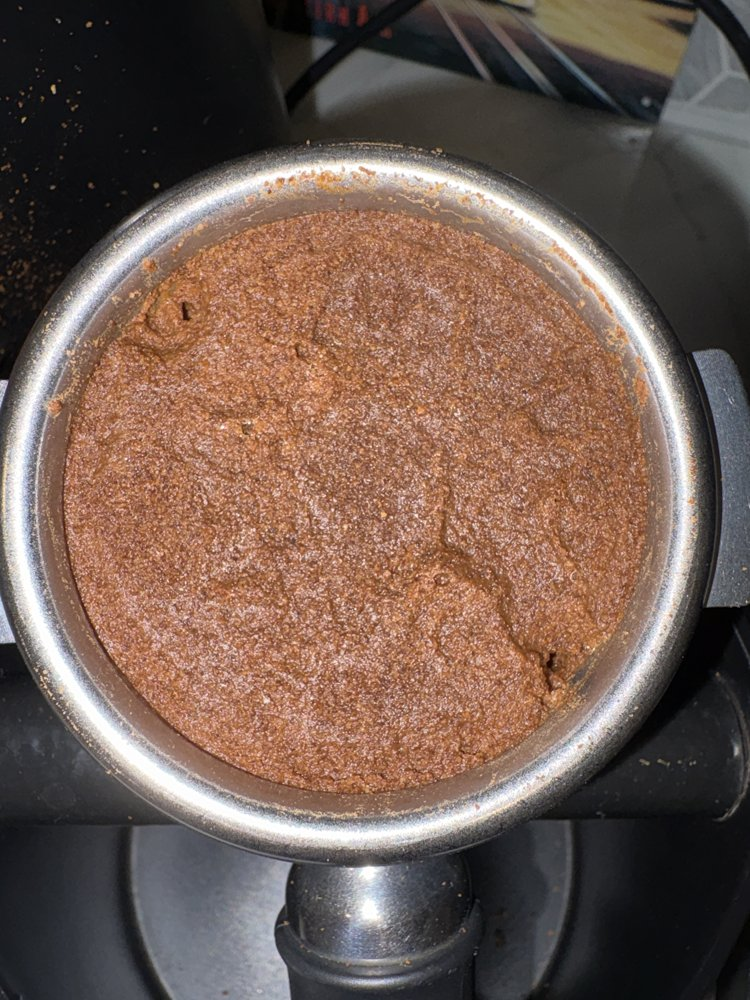 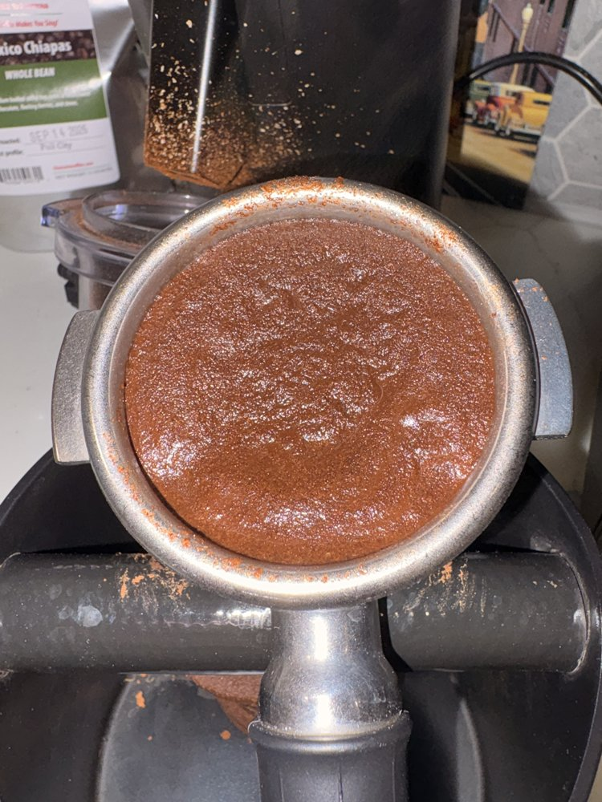

- **Left:** one crack runs from the center toward the lower right and ends in a pinhole at the wall, with another pinhole at the upper left.
- **Right:** wet pooling. Shiny, wetter patches cover a clear part of the surface instead of an even dull sheen.
- *Why not High:* the flaws cover only part of the puck, and much of the surface is still even.

### High

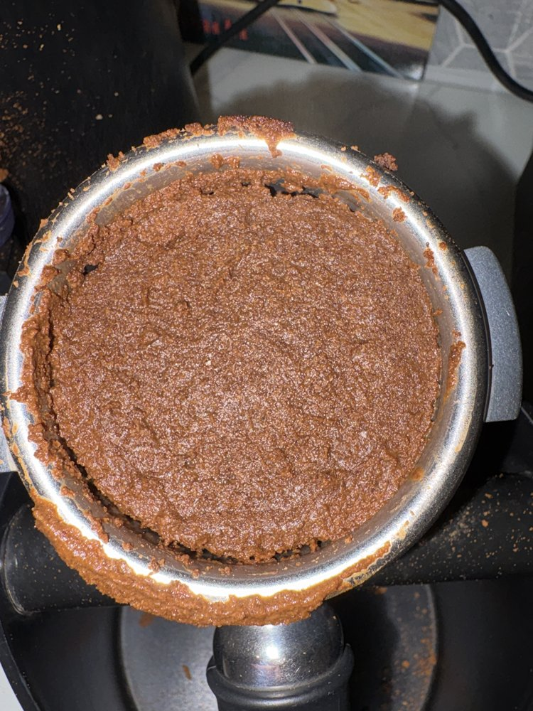 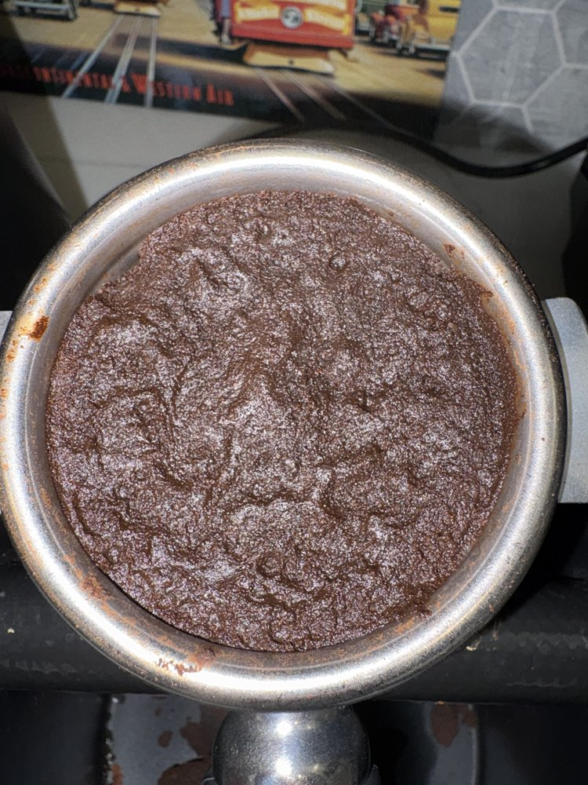

- **Left:** edge gap. The puck has pulled away from the wall, leaving a dark trench along the left side and bottom (well over a quarter of the way around), and grounds are pushed up onto the rim.
- **Right:** deep ridges and cracks run across the whole surface.
- *Why not Medium:* the damage is widespread, not limited to one area.

---

# PART B: Crema Photo, Apparent Extraction

## B1. What to Look For

Look at the foam layer in the cup and consider:

| Aspect             | What to notice                                                                              |
| ------------------ | ------------------------------------------------------------------------------------------- |
| **Color**          | Pale yellow/blond → golden/hazelnut/reddish-brown → very dark brown                         |
| **Coverage**       | Does foam cover the whole surface, or are there bare spots where dark liquid shows through? |
| **Uniformity**     | Even color, fine speckles/"tiger stripes" (normal), or blotchy, uneven patches              |
| **Bubble texture** | Fine, smooth foam, or large visible bubbles                                                 |

## B2. Labels

### Under

The crema looks **light and weak**.

- Pale yellow, blond, or light tan color.
- Often thin, with large or loose bubbles.
- May look watery or dissipate into bare patches.

### Balanced

The crema looks **rich and even**.

- Golden brown, hazelnut, or reddish-brown color.
- Covers the whole surface with fine, smooth foam.
- Speckling or darker "tiger stripe" streaks are normal here and are a sign of Balanced, not a flaw.

### Over

The crema looks **dark and broken**.

- Very dark brown, with the darkest areas approaching the color of the coffee beneath.
- Often thin, patchy, or with holes and bare spots.
- May show a dark ring at the edge or blotchy dark patches.

## B3. Decision Rules

1. **Color is the primary cue.** Use coverage and texture to decide close calls.
2. **Large bubbles alone do not mean Under.** Very fresh coffee can produce big bubbles even on a good shot. Use bubbles only as a tie-breaker together with color.
3. **Patchy crema:** if it is pale *and* patchy → **Under**; if it is dark *and* patchy → **Over**.
4. **Between two labels?** Choose the one that matches the **majority of the surface area**, and lower your confidence.
5. **Ignore** the cup, spills or drips on the rim, and reflections from lights.

## B4. Examples

### Under

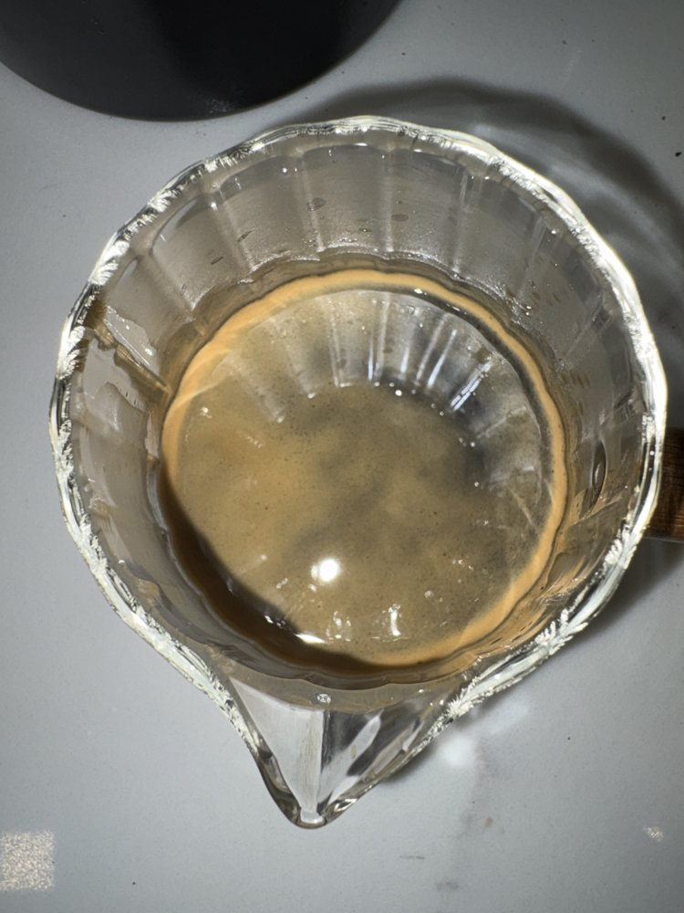 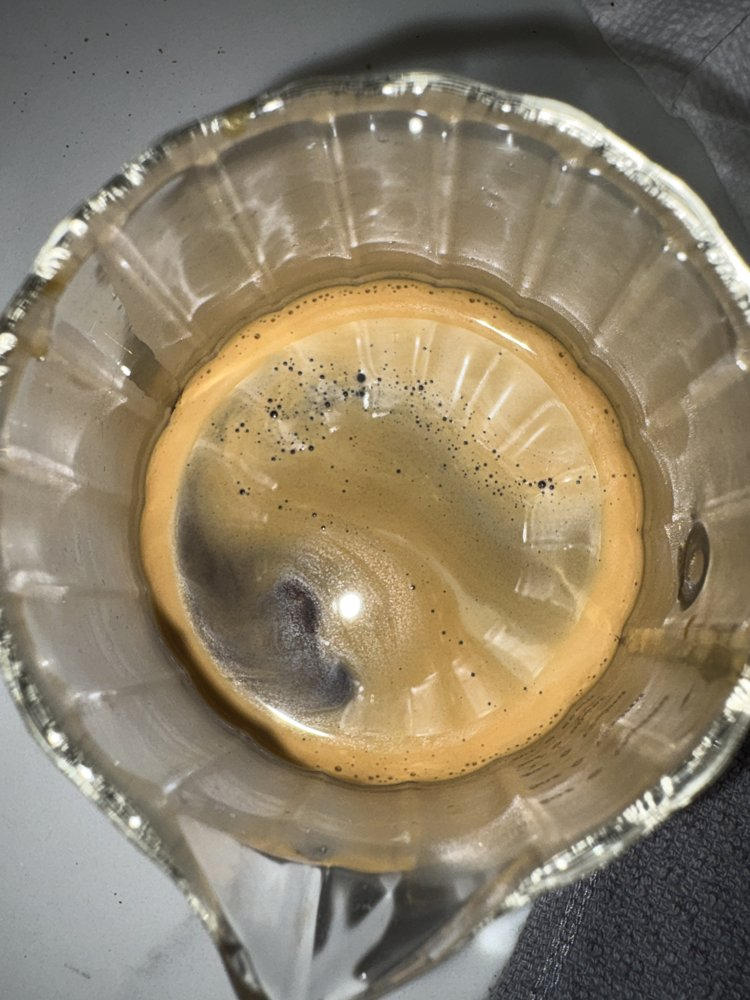

- **Left:** the crema is so thin and pale that the cup's pattern shows through.
- **Right:** pale blond, with loose bubbles and a bare patch at the lower left.
- *Why not Balanced:* the color is clearly lighter than golden brown, and coverage is weak.

### Balanced

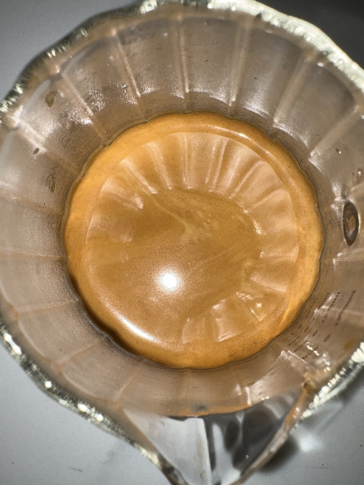 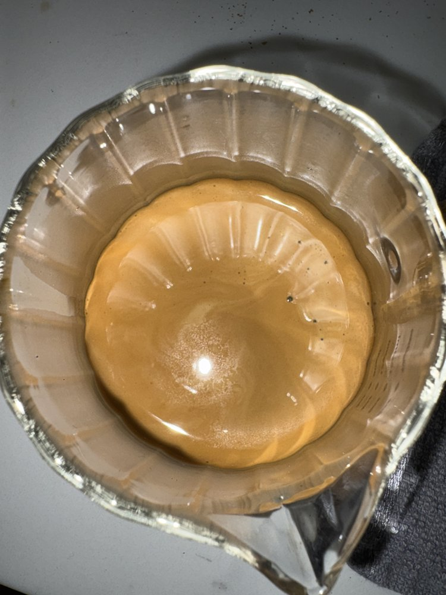

- **Left:** an even golden-hazelnut color with full coverage and light tiger striping.
- **Right:** even golden brown, with fine foam covering the whole surface.
- *Why not Over:* there are no dark blotches or bare spots.
- The ribbed pattern is the glass cup showing through the foam. Ignore it (rule B3.5).

### Over

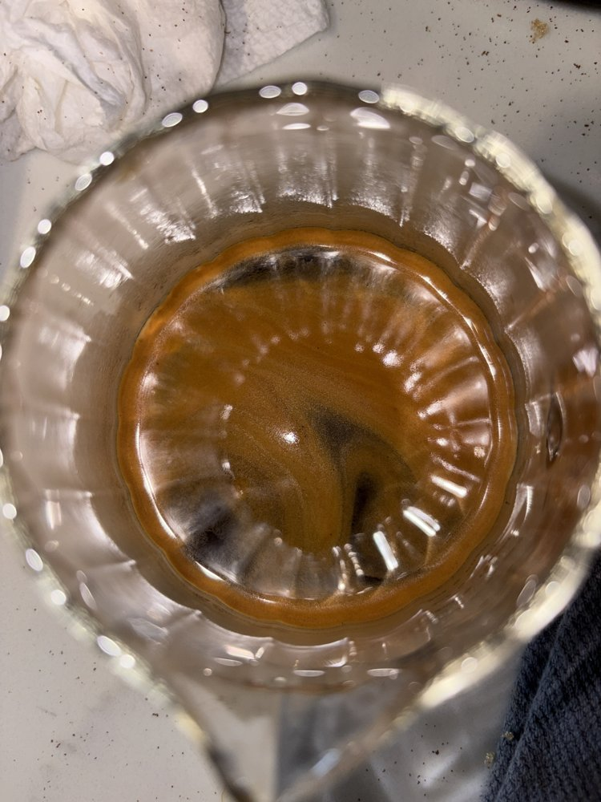 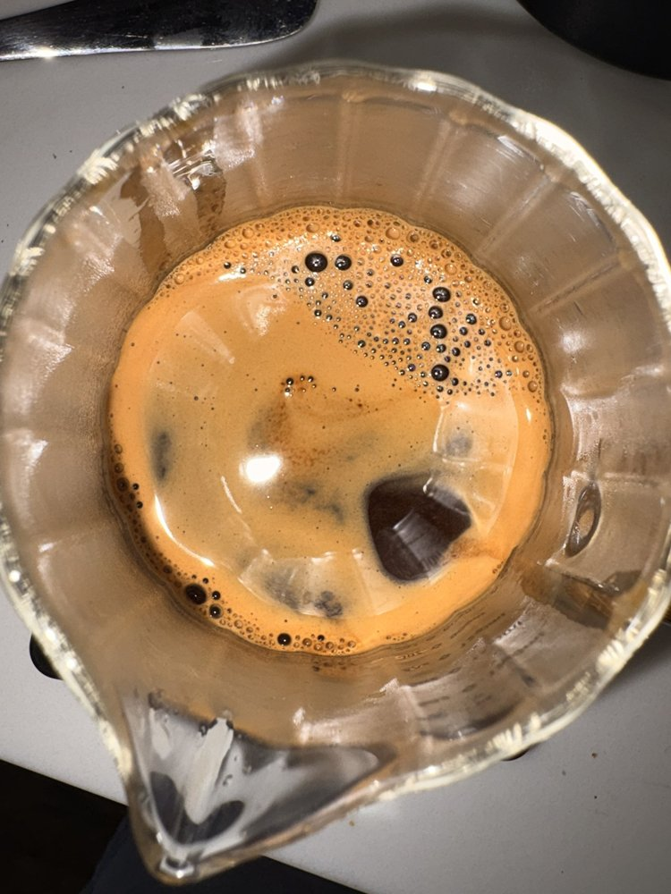

- **Left:** dark reddish brown, with dark streaks and bare spots where the coffee shows through.
- **Right:** dark reddish brown and broken up, with large holes where the dark coffee shows through. The big bubbles are not the deciding cue (rule B3.2); the dark color plus the holes are.
- *Why not Balanced:* both are darker than hazelnut and break up across the surface.

---

## 3. Quick Reference Card

| Puck   | Key sign                                            |
| ------ | --------------------------------------------------- |
| None   | Even, intact; only screen imprint                   |
| Low    | One small, isolated flaw                            |
| Medium | Several pinholes, one crack, or a moderate gap/pool |
| High   | Widespread cracks, craters, large gaps or pooling   |

| Crema    | Key sign                                     |
| -------- | -------------------------------------------- |
| Under    | Pale/blond, thin, loose                      |
| Balanced | Golden to reddish-brown, even, full coverage |
| Over     | Very dark, thin, patchy                      |

**When unsure:** puck → choose the lower level; crema → choose the label matching most of the surface. Always lower your confidence slider when unsure.

---

## 4. Output & Questions

- Setup instructions for the annotators are in README_annotators.md. Once you have finished your tasks, please either email me the output file or create a branch and PR to main with your results on the Github repo. Either method of submitting works fine as long as I get the data.
- For questions or problems, contact Elliot at [etpak@umich.edu](mailto:etpak@umich.edu) / Discord @elliotpak.

